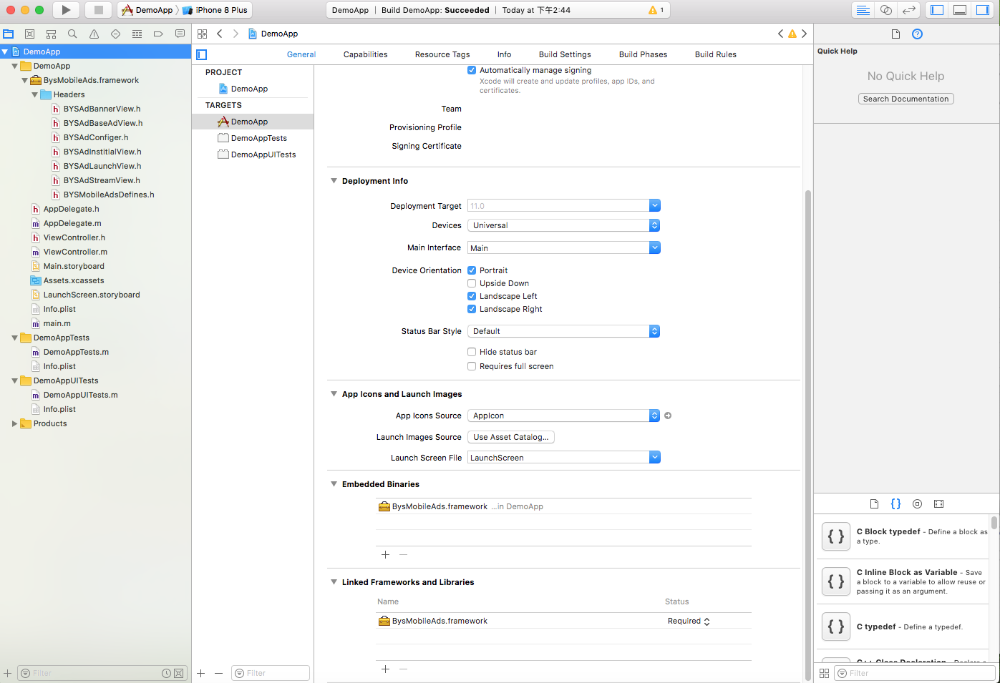
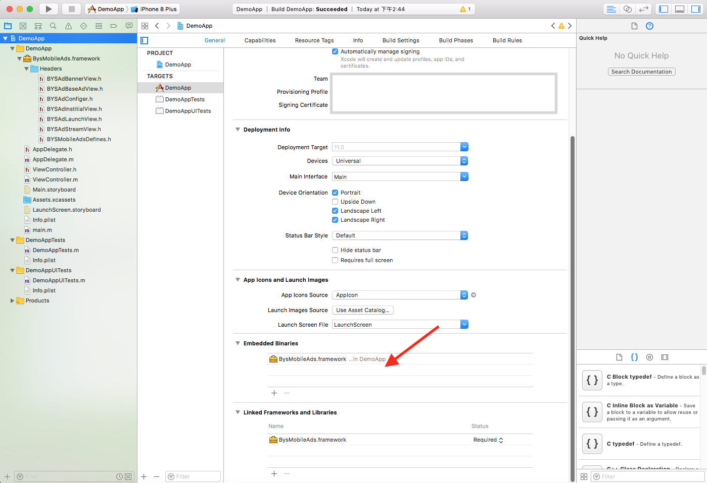
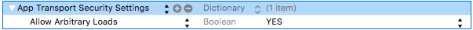

<h1>iOS广告集成文档</h1>

<h2>iOS Guidelines</h2>
You can get started with the following:

[Adding the SDK to your Project](#SDK)

[Preparing your App for iOS 9+](#iOS9)

[Initializing the SDK](#Initializing)

The latest version of AdCools SDK supports iOS 8 and later. Also, this version of iOS SDK requires XCode 8.0 and later.

| Version         | 0.01               | 
| -------------   |:-------------:      | 
| Size (.IPA Inflation)        | 1.51 MB |    
| SDK Link|[Download SDK](https://github.com/baiyisoftware/BysMobileAdsSDK)、 [Change Logs](https://github.com/baiyisoftware/BysMobileAdsSDK) 、[GitHub (Sample Code)](https://github.com/baiyisoftware/BysMobileAdsSDK) 、[Cocoapods](https://cocoapods.org/pods/InMobiSDK)|  


<span id="SDK"></span>
<h2>Adding the SDK to your Project</h2>

**Method 1**: Integration via Cocoapods (https://github.com/baiyisoftware/BysMobileAdsSDK)
Follow these steps :

a. Go to your Xcode project directory and create a pod file using the command below. 

```
pod init
```
b. Add the following to Podfile.  

```
pod 'BysMobileAds', '~> 0.0.7
```
Then, run the following command:


c. Run the command below to complete the task for dependency. 	

```
pod install
```

Workspace with pods is created.

**Method 2**: Integrating the framework directl
Add the following MANDATORY frameworks to your Xcode project:
	•	BysMobileAds.framework from the downloaded AdCools iOS SDK bundle
	
	



• Embedded Binaries Add BysMobileAds.framework



<span id="iOS9"></span>
<h3>Preparing your App for iOS 9+</h3>
App Transport Security (ATS), a default setting introduced with iOS 9 that mandates apps to make network connections only over TLS version 1.2 and later. Though InMobi is committed towards the adoption of HTTPS, the current setup requires our demand partners to support this change and be 100% compliant with all the requirements of ATS.
While we work with our partners progressing towards a secure environment, to ensure ads work on iOS 9 and later versions, you need to follow these steps as a near-term fix:

**• Disable ATS** (Recommended) - to ensure non-secure content from the partners work correctly in your updated apps. To disable ATS flag, add the following code snippet to your app's Info.plist.



```
<key>NSAppTransportSecurity</key>
<dict>
    <key>NSAllowsArbitraryLoads</key>
    <true/>
</dict>
```
<span id="Initializing"></span>
## Initializing the SDK
Import the InMobi SDK header in your AppDelegate.h file:

```
#import "ViewController.h"
#import <BysMobileAds/BYSAdConfiger.h>

@interface AppDelegate ()<BYADConfigerDelegate,BYSAdLaunchDelegate>

@end

@implementation AppDelegate
```

Initialize the SDK in the didFinishLaunchingWithOptions method within the app delegate's .m file:

```
- (BOOL)application:(UIApplication *)application didFinishLaunchingWithOptions:(NSDictionary *)launchOptions {
    // Override point for customization after application launch.
    
    [BYSAdConfiger configerWithAppKey:@"" delegate:self];

    return YES;
}

```
Then implement the proxy method in AppDelegate.

```
- (void)configerDidSucess:(BYSAdConfiger *)configer {
    NSLog(@"ConfigerDidSucess call back");
}
- (void)configerDidFailed:(BYSAdConfiger *)configer withError:(NSError *)error{
    NSLog(@"configerDidFailed call back");
    NSString *str =  [NSString stringWithFormat:@"configerDidFailed:%@",error.localizedDescription];
    NSLog(@"%@",str);
}
```

Start monetizing your iOS app with these ad formats:

[Banner Ads](media/15090677250069/iOS%20Guidelines%20%7C%20Banner%20Ads.html)

[Interstitial Ads](media/15090677250069/iOS%20Guidelines%20%7C%20Institial%20Ads.html)

[open Ads](media/15090677250069/iOS%20Guidelines%20%7C%20Launch%20Ads.html)

[Native Ads](media/15090677250069/iOS%20Guidelines%20%7C%20Native%20Ads.html)

		

