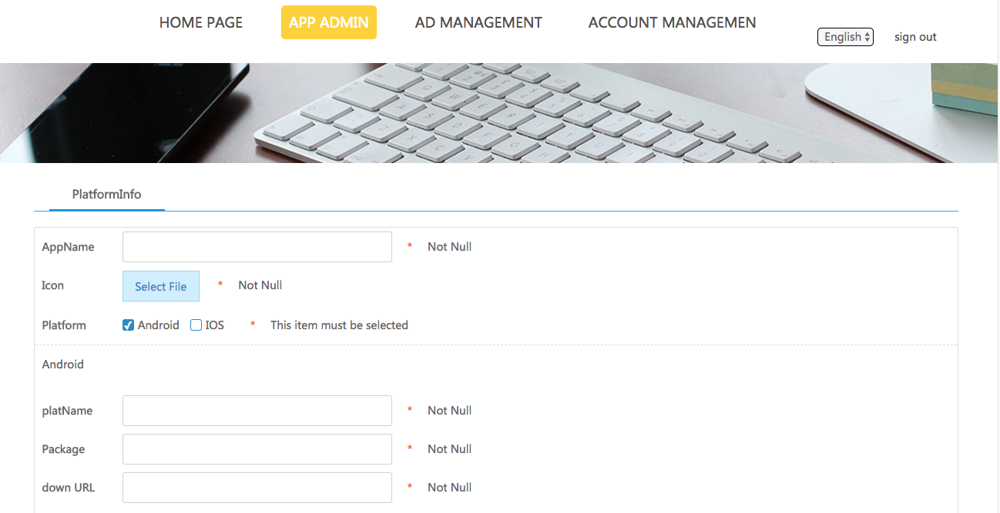

## Monetize | Getting Started
	•	Step 1: Creating an AdCools Account
	•	Step 2: Registering your App
	•	Step 3: Creating Placement Ids
	•	Step 4: Filling out the Payout Information
	•	Step 5: Controlling the Ad Experience with Filters
	
###Step 1: Creating an InMobi Account
To set up an AdCools account:
[Sign up](http://www.adcools.com/adp-web/login) as a publisher.


Complete the e-mail verification for your account.
###Step 2: Registering your App

###Step 3: Creating Placement Ids

####Start Monetizing Now!
[iOS Guidelines](media/15090975244643/%3Ch1%3EiOS%E5%B9%BF%E5%91%8A%E9%9B%86%E6%88%90%E6%96%87%E6%A1%A3%3C-h1%3E.html)


## Monetize | Getting Started
	•	Step 1: Creating an AdCools Account
	•	Step 2: Registering your App
	•	Step 3: Creating Placement Ids
	•	Step 4: Filling out the Payout Information
	•	Step 5: Controlling the Ad Experience with Filters
	
###Step 1: Creating an InMobi Account
To set up an AdCools account:
[Sign up](http://www.adcools.com/adp-web/login) as a publisher.


Complete the e-mail verification for your account.
###Step 2: Registering your App

###Step 3: Creating Placement Ids

####Start Monetizing Now!
[iOS Guidelines](media/15090975244643/%3Ch1%3EiOS%E5%B9%BF%E5%91%8A%E9%9B%86%E6%88%90%E6%96%87%E6%A1%A3%3C-h1%3E.html)


###iOS Guidelines | Banner Ads
Banner Ads are graphical ad, typically including a combination of static/animated images and text designed to convey a marketing message and/or cause the user to take an action. All types of apps can leverage banner ads for monetization.

Follow these steps to start monetizing with Banner ads:
	•	[Setting up a Banner Ad](#set)
	•	[Creating a Banner Ad](#create)
	
<span id="set"></span>
**Setting up a Banner Ad**
After adding your app, select BANNER AD to create a placement for ad type Banner.


Once you create the banner placement, you will have the placement id.


<span id="create"></span>
####Creating a Banner Ad
Banner is a subclass of UIView that shows and the corresponding user touches the native ad. Here's how the BysMobileAds SDK banner ad is initialized.

**a. Programmatic Instantiation**
Import the headers and declare a Banner instance in your ViewController.h file. Your ViewController header file should look like this:
```
#import <UIKit/UIKit.h>
#import <BysMobileAds/BYSAdBannerView.h>

#define BYS_Banner              CGSizeMake(320, 50)//Custom

@interface BannerDemoViewController ()<BYSAdBannerDelegate>{
    BYSAdBanner *_banner;
}
```

Instantiate the banner object. Your ViewController.m file should look like this:

```
- (void)viewDidLoad {
 [super viewDidLoad];
 /*
 You can use the following transitions while refreshing your banner object:
	◦	BYADAdPositionTopOfScreen
	◦	BYADAdPositionBottomOfScreen
	◦	BYADAdPositionTopLeftOfScreen
	◦	BYADAdPositionTopRightOfScreen
	◦	BYADAdPositionBottomLeftOfScreen
	◦	BYADAdPositionBottomRightOfScreen
 */
  _banner = [BYSAdBanner createBannerWithUnitKey:@"" size:BYS_Banner adPosition:BYADAdPositionBottomOfScreen];
    _banner.delegate = self;
}
```
By default, Banner does not refresh, you can set the background in the developer Banner settings refresh and refresh time, in the SDK to provide refresh time settings (default is 0, that is not refreshed).
```
 [_banner setCircleTime:0];
```
Banner needs to be loaded manually with the control display.
```
    [_banner load];
    [_banner show];
```
For ad status callbacks, implement the delegate property of Banner. The following callbacks are supported:

```
- (void)bannerDidReceivedData:(BYSAdBanner *)banner{
    NSLog(@"Banner Load ok");
}
- (void)bannerFailToReceiveData:(BYSAdBanner *)ad withError:(NSError *)error{
    NSLog(@"Banner Load false");
}
- (void)bannerWillPresent:(BYSAdBanner *)banner{
    NSLog(@"Banner will present on screen");
}
- (void)bannerDidPresent:(BYSAdBanner *)banner{
    NSLog(@"Banner is show on screen");
}
- (void)bannerDidClicked:(BYSAdBanner *)banner{
    NSLog(@"Banner is clicked");
}
- (void)bannerDidClosed:(BYSAdBanner *)banner{
    NSLog(@"Banner is closed");
}
- (void)bannerPlayVideo:(BYSAdBanner *)banner{
    NSLog(@"Banner Play Video");
}
- (void)bannerPlayVideoFinshed:(BYSAdBanner *)banner{
    NSLog(@"Banner Play Video Finished");
}```

	


###iOS Guidelines | Institial Ads
Interstitial ads are full page ads placed at natural break points in the app flow..

Follow these steps to start monetizing with Institial ads:
	•	[Setting up a Institial Ad](#setting)
	•  [Creating a Institial Ad](#create)
	
<span id="setting"></span>
**Setting up a Institial Ad**
After adding your app, select Institial AD to create a placement for ad type Institial.


Once you create the Institial placement, you will have the placement id.


<span id="create"></span>
####Creating a Institial Ad
The Institia is simply a UIImage subclass displaying full screen ads that respond to user touch.

Import the headers and declare an interstitial instance in your ViewController.h file. Your ViewController header file should look like this:

**a. Programmatic Instantiation**
Import the headers and declare a Institial instance in your ViewController.h file. Your ViewController header file should look like this:
```
#import <UIKit/UIKit.h>
#import <BysMobileAds/BYSAdInstitialView.h>

@interface ViewController : UIViewController <BYSAdInstitialDelegate>{
    BYSAdInstitial *_insititial;
}
@end
```

Instantiate the Institial object. Your ViewController.m file should look like this:

```
- (void)viewDidLoad {
 [super viewDidLoad];
  _insititial = [BYSAdInstitial createADInstitialWithUnityKey:@""];
    _insititial.delegate = self;
}
```
Banner needs to be loaded manually with the control display.
```
    [_insititial load];
    [_insititial show];
```
Important: Create only one object per placement ID and reuse it for subsequent ad loads.

For ad status callbacks, implement the delegate property of Institia. The following callbacks are supported:

```
#pragma -mark BYSAdInstitialDelegate
- (void)institialDidReceivedData:(BYSAdInstitial *)Institial{
    NSLog(@"Institial Load ok");
}
- (void)institialFailToReceiveData:(BYSAdInstitial *)Institial withError:(NSError *)error{
    NSLog(@"Institial Load false");
}
- (void)institialWillPresent:(BYSAdInstitial *)Institial{
    NSLog(@"Institial will present on screen");
}
- (void)institialDidPresent:(BYSAdInstitial *)Institial{
    NSLog(@"Institial is show on screen");
}
- (void)institialDidClicked:(BYSAdInstitial *)Institial{
    NSLog(@"Institial is clicked");
}
- (void)institialDidClosed:(BYSAdInstitial *)Institial{
    NSLog(@"Institial is closed");
}

- (void)institialPlayVideo:(BYSAdInstitial *)Institial{
    NSLog(@"InstitialPlayVideo");
}
- (void)institialPlayVideoFinished:(BYSAdInstitial *)Institial{
    NSLog(@"InstitialPlayVideoFinished");
}
```
	


###iOS Guidelines | Launch Ads
Open screen ads are full page ads placed at natural, placed in the APP start time.With 10 times the real estate as compared to Launch ads, Interstitials are guaranteed to catch your user's' eye and drive higher revenue for your mobile business..

Follow these steps to start monetizing with Launch ads:
	•	[Setting up a Launch Ad](#setting)
	•	[Creating a Launch Ad](#create)
	
<span id="setting"></span>
**Setting up a Launch Ad**
After adding your app, select Launch AD to create a placement for ad type Launch.


Once you create the Launch placement, you will have the placement id.


<span id="create"></span>
####Creating a Launch Ad
Startup is just a UIImage subclass that shows ads that can respond to user touch.
The following BysMobileAds SDK provides the mechanism for launching ads:

**a. Programmatic Instantiation**
Import the headers and declare a Launch instance in your ViewController.h file. Your ViewController header file should look like this:
```
#import <UIKit/UIKit.h>
#import "AppDelegate.h"
#import "ViewController.h"
#import <BysMobileAds/BYSAdConfiger.h>
#import <BysMobileAds/BYSAdLaunchView.h>
```

Instantiate the Launch object. Your ViewController.m file should look like this:

```
- (BOOL)application:(UIApplication *)application didFinishLaunchingWithOptions:(NSDictionary *)launchOptions {
    // Override point for customization after application launch.
//   Initialize the ad Api
    [BYSAdConfiger configerWithAppKey:@"" delegate:self];
//
//  Set to open or close the open screen ad
    BYSAdConfiger *configer = [BYSAdConfiger sharedConfiger];
    configer.enableLauch = YES;
    [BYSAdLaunch configLaunchWithUnitKey:@"" delegate:self];
 
    return YES;
}
```

For ad status callbacks, implement the delegate property of Launch. The following callbacks are supported:

```
#pragma mark -- BYSAdLaunchDelegate 
- (void)launchDidReceivedData:(BYSAdLaunch *)launch{
    NSLog(@"LaunchDidReceivedData call back");
}
- (void)launchFailToReceiveData:(BYSAdLaunch *)launch withError:(NSError *)error{
    NSLog(@"LaunchFailToReceiveData call back");
}
- (void)launchDidClicked:(BYSAdLaunch *)launch{
    NSLog(@"LaunchDidClicked call back");
}
- (void)launchDidClosed:(BYSAdLaunch *)launch{
    NSLog(@"LaunchDidClosed call back");
}
- (void)launchPlayVideo:(BYSAdLaunch *)launch{
    NSLog(@"LaunchPlayVideo call back");
}
- (void)launchPlayVideoFinished:(BYSAdLaunch *)launch{
    NSLog(@"LaunchPlayVideoFinished call back");
}
```
	


###iOS Guidelines | Native Ads
BysMobileAds Native ads seamlessly blend in with your app’s content, maximizing user engagement without compromising on user experience. You can choose and customize the layout that best matches the design of your app. It is ideal for news, utility and communication apps.

Follow these steps to start monetizing with Native ads:
	•	[Setting up a Native Ad](#setting)
	•	[Creating a Native Ad](#create)	
<span id="setting"></span>
**Setting up a Native Ad**
After adding your app, select Native AD to create a placement for ad type Native.


Once you create the Native placement, you will have the placement id.


<span id="create"></span>
####Creating a Native Ad
Native ads are only displayed in the ad to respond to the UIView subclasses that the user touches. The following provides the mechanism by which the BysMobileAds SDK provides Native ads:

**a. Programmatic Instantiation**
Import the headers and declare a Native Stream instance in your ViewController.h file. Your ViewController header file should look like this:
```
#import <UIKit/UIKit.h>
#import <BysMobileAds/BYSAdStreamView.h>

@interface ViewController : UIViewController <BYSAdStreamViewDelegate,BYSAdStreamDelegate>{

    BYSAdStream *_stream;
}
@end
```

Instantiate the Native object. Your ViewController.m file should look like this:

```
- (void)viewDidLoad {
 [super viewDidLoad];
  BYSAdStream *stream = [BYSAdStream createStreamWithUnitkey:@""];
   stream.delegate = self;
   _stream = stream;
    
   //The method call generates the Native ad, which returns the advertisement view (UIView subclass) in the callback, which can be called multiple times
  [_stream makeAdViewWithStreamViewDelegate:self];
}
```
For ad status callbacks, implement the delegate property of Native. The following callbacks are supported:

```
#pragma mark -
#pragma mark BYSAdStreamDelegate
/// Ad data load sucess callback
- (void)streamDidReceiveData:(BYSAdStream *)streamAd {

}
/// Ad data load false callback
- (void)stream:(BYSAdStream *)Ad didFailToReceiveDataWithError:(NSError *)error {
    NSLog(@"BYSAdStream receive ad data with error:%@", error);
}

#pragma mark -
#pragma mark BYSAdStreamViewDelegate
- (void)streamViewDidClicked:(BYSAdStreamView *)streamView {
//    BYADAdDataModel *model = streamView.dataModel;
//    NSLog(@"stream view did clicked model = %@",model);
}
/// when streamView layout is finished it's view height is formed.
- (void)streamViewLayoutFinished:(BYSAdStreamView *)streamView {
    /// when streamView layout is finished then append ad view to scrollView
      [self.view addSubview:streamView];
}
```
	


